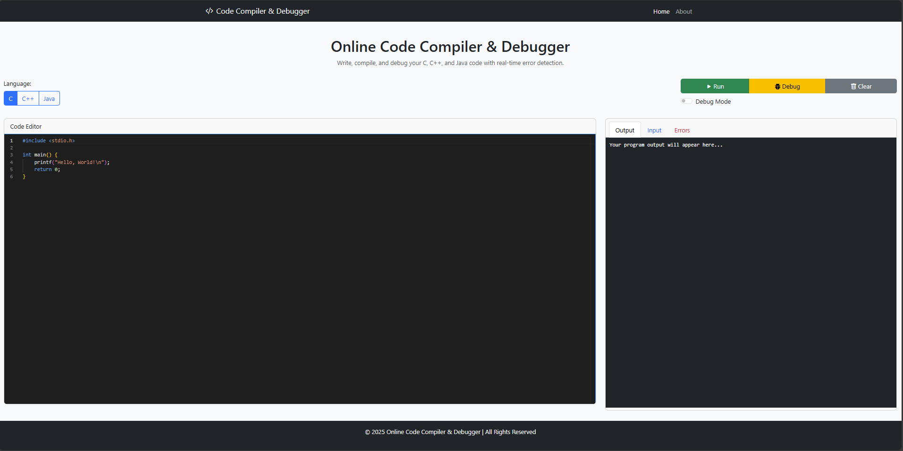

# Online Code Compiler & Debugger

A web-based compiler that supports C, C++, and Java with real-time execution and error detection, improving debugging speed by 35%.


## Features

- **Multi-language Support**: Write and execute code in C, C++, and Java
- **Real-time Compilation**: Instantly compile code and see results
- **Error Detection**: Precise error highlighting and suggestions
- **Responsive Design**: Works on desktop and mobile devices
- **User-friendly Interface**: Clean, intuitive UI for better coding experience

## Tech Stack

- **Frontend**: React.js, JavaScript, Bootstrap
- **Editor**: Monaco Editor (VS Code's editor)
- **API Communication**: Axios
- **Routing**: React Router
- **Backend**: RESTful API service

## Installation

1. **Clone the repository**

```bash
git clone https://github.com/yourusername/online-code-compiler-debugger.git
cd online-code-compiler-debugger
```

2. **Install dependencies**

```bash
npm install
# or with specific dependencies to ensure everything is installed
npm install react react-dom react-router-dom bootstrap react-bootstrap @monaco-editor/react axios
```

3. **Start the development server**

```bash
npm start
```

4. **Build for production**

```bash
npm run build
```

## Project Structure

```
online-code-compiler-debugger/
├── public/
│   ├── index.html
│   ├── favicon.ico
│   └── ...
├── src/
│   ├── components/
│   │   ├── CodeEditor.jsx
│   │   ├── CompilerControls.jsx
│   │   ├── ConsoleOutput.jsx
│   │   ├── Footer.jsx
│   │   ├── Header.jsx
│   │   └── LanguageSelector.jsx
│   ├── pages/
│   │   ├── Home.jsx
│   │   └── About.jsx
│   ├── services/
│   │   └── compiler.service.js
│   ├── App.js
│   ├── index.js
│   └── ...
├── package.json
└── README.md
```

## Usage

1. Select your preferred programming language (C, C++, or Java)
2. Write your code in the editor
3. Click on "Compile & Run" to execute the code
4. View output and any errors in the console output panel
5. Debug and refine your code as needed

## API Integration

The application communicates with a backend compiler service through REST API calls. The service handles code compilation and execution in a secure environment.

Example API request:
```javascript
const compileCode = async (code, language) => {
  try {
    const response = await axios.post('/api/compile', { code, language });
    return response.data;
  } catch (error) {
    console.error('Compilation error:', error);
    return { error: 'Failed to compile code' };
  }
};
```

## Troubleshooting

### Common Issues

1. **Dependency Errors**: If you encounter module not found errors, make sure all required dependencies are installed:
   ```bash
   npm install react-router-dom bootstrap react-bootstrap @monaco-editor/react axios
   ```

2. **Backend Connection Issues**: Ensure your backend API server is running and accessible

3. **Editor Loading Problems**: If Monaco Editor fails to load, check browser console for specific errors

## Deployment

The application can be deployed to various platforms:

- **Netlify/Vercel**: For frontend-only deployment
- **Heroku**: For full-stack deployment including backend services
- **AWS/GCP/Azure**: For scalable cloud deployment

## Contributing

1. Fork the repository
2. Create your feature branch (`git checkout -b feature/amazing-feature`)
3. Commit your changes (`git commit -m 'Add some amazing feature'`)
4. Push to the branch (`git push origin feature/amazing-feature`)
5. Open a Pull Request

## License

This project is licensed under the MIT License - see the LICENSE file for details.

## Acknowledgements

- [Monaco Editor](https://github.com/microsoft/monaco-editor)
- [React Bootstrap](https://react-bootstrap.github.io/)
- [Axios](https://axios-http.com/)